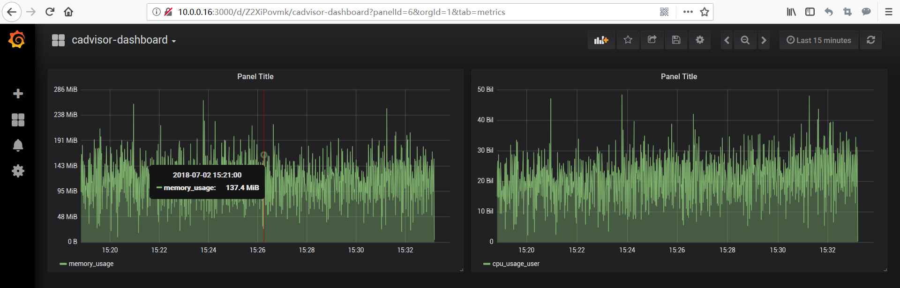

# 工作原理

1. cAdvisor ，相当于一个数据采集器，采集Docker容器的性能指数；
2. InfluxDB，相当于一个数据收集器，把cAdvisor的数据存储起来；
3. Grafana，性能监控的展示，有丰富的仪表盘（而且很漂亮），监控和消息推送；

# 成功展示

详细说明，可以参考：http://blog.alys114.com/2018/07/02/docker-cij/
